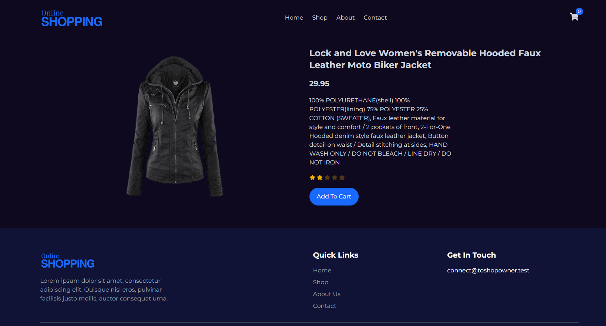

# 🛍️ Demo Web Store (React + TypeScript)

A demo e-commerce application with a shopping cart, created to showcase modern frontend architecture and practical usage of state management, API integration, and clean UI development.

This project is not intended for commercial use and was built purely for learning and demonstration purposes.

## 📌 Overview

The application displays a list of products fetched from a public API (Fake Store API) and implements core online store functionality:

- product catalog browsing
- product details view
- adding products to the cart
- increasing / decreasing item quantity
- removing items from the cart
- calculating the total price

The project demonstrates how to build a lightweight and scalable SPA without heavy state-management solutions.

## ⚙️ Tech Stack
- React
- TypeScript
- Zustand
- Tailwind CSS
- Axios
- Fake Store API (https://fakestoreapi.com/products)

## 🧠 Architectural Decisions

Zustand was chosen as a minimalistic alternative:

- no boilerplate code
- simple and scalable store structure
- excellent performance
- ideal for pet-projects and mid-sized apps

## 🚀 Core Features

### 📦 Product Loading

Products are fetched asynchronously using Axios when the application initializes.

### 🛒 Cart Management

The Zustand store handles cart state:

- add product to cart
- update quantity
- remove product
- clear cart

## Installation & Run

### 1️⃣ Clone the repository
    
```
git clone <repo-url>
cd demo-web-store
```
        
### 2️⃣ Install dependencies

``` 
npm install 
```

### 3️⃣ Start development server

``` 
npm run dev 
```

The app will be available at:

``` 
http://localhost:5173 

```
## 🧑‍💻 Author

Developed as a portfolio pet-project for demonstrating frontend engineering skills.

## 📄 License

MIT — free to use for educational and demonstration purposes.

